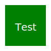

  

  

  

  
  
  
  
  

---

### 🚀 About Me

  <em>✨ Software Systems Engineer | 🤖 AI Engineer | 📊 Data Science</em>

 

  <em>Passionate about leveraging data science and machine learning to solve complex problems. 
  My expertise lies in transforming raw data into meaningful insights, developing predictive models,  
  applying advanced mathematical techniques to drive innovative solutions, 
  and developing full-stack applications to deploy scalable AI solutions.</em>

 

- 🔭 Currently developing **AI-powered trading systems**
- 🌱 Mastering **Deep Learning & Neural Networks**
- 👯 Looking to collaborate on **open-source ML projects**
- 💡 Passionate about **quantitative finance & algorithmic trading**
- 🎯 2025 Goal: Contribute to 10+ open source projects

---

### 🛠️ Tech Stack

#### 🔬 Data Science & ML

  

#### 💻 Programming & Backend

  

#### 📊 Data Visualization & Analysis

  

#### 🎨 Frontend Development

  

#### 🗄️ Database Systems

  

#### ☁️ Cloud & Deployment

  

#### 🧰 Development Tools

  

---

### 📈 GitHub Analytics

 
   

  <a href="https://github.com/espinosacodes">
    &nbsp;&nbsp;
    
  </a>

  

---

### 💡 Recent Projects

| Project | Description | Tech Stack |
|---------|-------------|------------|
| [Algorithmic Trading Agency](https://github.com/espinosacodes/deltanexusweb) | Typescript based SPA with tailwind | Typescript, Tailwind, Javascript, CSS|
| [Algorithmic Trading](https://github.com/espinosacodes/mql4Scripts) | Algorithmic trading system | MQL4 |

<!--| [Neural Network Framework](https://github.com/) | Custom deep learning implementation | C++, CUDA, Python |-->

---

  
  
  
  **"Don't hurry your code. Make sure it works well and is well designed"** - Linus Torvalds 
  

